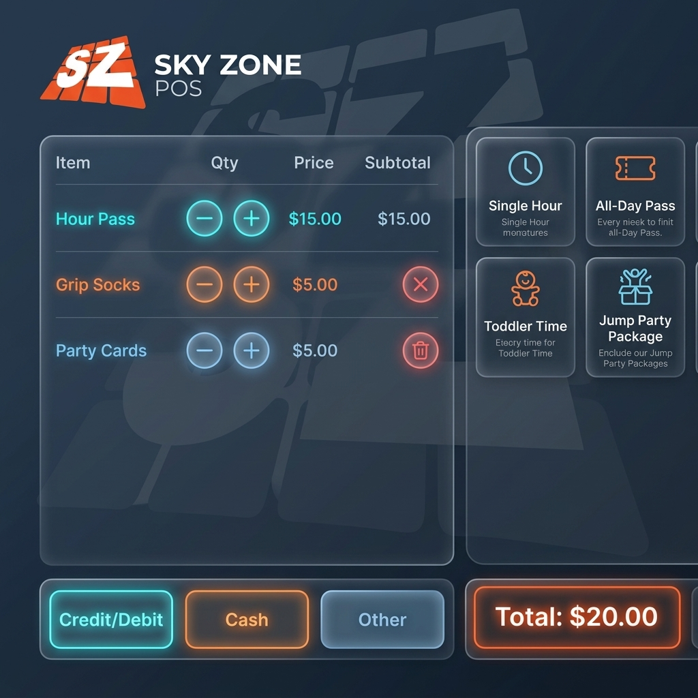

# 📖 Manual de Usuario - Sistema de Punto de Venta SkyZone

Este manual didáctico explica paso a paso el funcionamiento del sistema de punto de venta (POS) de **SkyZone Santa Fe**. Está diseñado para guiar tanto a cajeros como a administradores en sus actividades diarias.

---

## 🌓 1. Modo Claro vs. Modo Oscuro (Diseño Premium)

El sistema cuenta con una interfaz premium basada en **Neumorfismo**, que simula relieve físico tridimensional. Ofrece dos temas visuales que puedes cambiar en cualquier momento:

*   **Modo Claro:** Diseñado para alta luminosidad y claridad durante el día.
*   **Modo Oscuro (Cyber Dark):** Ideal para turnos nocturnos, reduciendo la fatiga visual mediante contrastes suaves y acentos de neón.

### ¿Cómo cambiar de tema?
*   **En Taquilla y Cafetería:** Haz clic en el botón circular (Luna/Sol) ubicado en la barra lateral izquierda, justo debajo del botón de **Home** (Inicio).
*   **En el Login y Panel Administrativo:** Haz clic en el botón flotante circular de la esquina inferior izquierda de la pantalla.

*Figura 1: Interfaz general del Punto de Venta en Modo Claro.*

*Figura 2: Interfaz general del Punto de Venta en Modo Oscuro.*

---

## 🎟️ 2. Módulo de Taquilla (Venta de Entradas)

La pantalla de Taquilla está enfocada en el registro de saltadores y la venta rápida de brazaletes y accesorios.

### A. Tipos de Entradas
1.  **Entradas por Tiempo:** `MEDIUM` (60 min), `STANDARD` (120 min), `PREMIUM` (180 min) y `SKY PASS` (Tiempo ilimitado).
2.  **Acompañamiento:** Entrada de `APOYO` para adultos que no saltan.
3.  **Paquetes Promocionales:** `Paquete Peque Aventura`, `Peque Diversión`, `Super Aventura` y `Paquete Familiar`.

### B. Hora de Salida Automática (Zona Horaria CDMX)
El sistema calcula **automáticamente la hora de salida** sumando la duración de la entrada a la hora actual de la Ciudad de México (CDMX), evitando errores de cálculo manual del cajero.
*   *Ejemplo:* Si vendes una entrada `STANDARD` (120 minutos) a las 4:00 PM, la base de datos registrará la salida programada exactamente a las 6:00 PM.

### C. Contador Dinámico de Calcetas (`SkySocks`)
*   Los paquetes `Peque Aventura`, `Peque Diversión` y `Super Aventura` **incluyen 1 par de calcetas** por boleto.
*   Al concretar la venta de uno de estos paquetes, el sistema añade dinámicamente la etiqueta `(+1 calcetas)` al resumen para que el cajero sepa que debe entregarlas en mostrador.
*   Matemáticamente, el panel administrativo sumará 1 calceta vendida por cada unidad de estos paquetes cobrada.

### D. Locker con Precio Abierto
El botón de **Locker** no tiene un costo estático:
1.  Al hacer clic en **Agregar**, se abrirá una ventana emergente en pantalla solicitando ingresar el precio del locker.
2.  Digita la cantidad acordada con el cliente (ej. `30` o `40`).
3.  El Locker se agregará al carrito con el precio exacto ingresado, y la tarjeta del Locker mostrará ese valor para fácil confirmación visual del cajero.

---

## ☕ 3. Módulo de Cafetería (Cuentas Abiertas e Items Libres)

La Cafetería está diseñada para registrar consumos continuos a lo largo de la estancia de los visitantes.

### A. Sistema de Cuentas Abiertas (Mesas)
Para permitir que los clientes consuman y paguen al final de su visita:
1.  **Ver Cuentas Minimizadas:** En la parte derecha verás el listado de todas las cuentas activas (ej. `Principal`, `Mesa 5`, `Llevar Carlos`) representadas como grandes botones con sus montos acumulados en tiempo real.
2.  **Abrir una Cuenta Nueva:** Haz clic en el botón superior **➕ NUEVA CUENTA**, escribe el nombre identificador y presiona Aceptar.
3.  **Desplegar / Editar Cuenta:** Haz clic sobre cualquier cuenta del listado. Esta se desplegará en toda la barra lateral cubriendo el resto. Aquí podrás ver la lista detallada de consumos, aumentar cantidades con el botón `+` o reducirlas con `-`.
4.  **Minimizar Cuenta:** Presiona el botón **⬅️ Minimizar** en la parte superior del carrito para regresar al listado general de cuentas sin perder ningún cambio.
5.  **Eliminar Cuenta Completa:** En la vista de cuentas minimizadas, haz clic en la **✕** del botón de la cuenta. Saltará una advertencia de seguridad: *¿Seguro que quieres eliminar la cuenta "nombre"?*. Si aceptas, la cuenta se borrará permanentemente de forma segura.

### B. Agregar Producto Fuera del Menú (Precio Abierto)
Si un cliente pide un artículo que no está programado en los botones estándar del menú:
1.  Ve a la sección **"Otros Productos"** al final del scroll de Cafetería.
2.  Escribe manualmente el **Nombre del Producto** (ej. `Gelatina de Piña`) y su **Precio ($)** (ej. `25.50`).
3.  Haz clic en **➕ AGREGAR AL CARRITO** y el producto personalizado se integrará al ticket con los datos digitados.

---

## 🛒 4. Operaciones Comunes del Carrito (Taquilla & Cafetería)

*   **Eliminar Elemento en Un Solo Clic:** Si quieres remover por completo un producto del carrito sin tener que reducir su cantidad a cero uno por uno, simplemente haz clic en el icono rojo del **Bote de Basura (🗑️)** ubicado a la derecha del producto.
*   **Vaciar Carrito Entero:** Haz clic en el bote de basura grande de la cabecera del carrito.
*   **Cobro (Completar Orden):** Presiona **COMPLETAR ORDEN**, selecciona el método de pago (**Efectivo** o **Tarjeta**) y confirma. Esto registrará la venta en la base de datos de Firebase, limpiará esa cuenta de la barra lateral y abrirá el diálogo de impresión de ticket físico.

---

## 📊 5. Panel Administrativo (Admin Dashboard)

El panel administrativo es la central de control del parque y ofrece sincronización en tiempo real de todas las ventas del día.

*Figura 3: Panel administrativo con métricas, lista de saltadores activos y panel de control CRUD de ventas.*

### A. Métricas del Día (Tarjetas Neumórficas)
*   **Ingresos Totales:** Suma de todas las ventas del día en curso.
*   **Breakdown de Métodos de Pago:** Desglose en tiempo real de cuánto dinero ingresó por **Efectivo** y cuánto por **Tarjeta**.
*   **Saltadores Activos:** Contador dinámico del número de personas saltando dentro del parque en este preciso instante.
*   **Calcetas Vendidas:** Total acumulado de calcetas entregadas (incluyendo calcetas compradas como adicional y calcetas incluidas por defecto en paquetes).

### B. Lista de Saltadores en Tiempo Real (Guest List)
*   Muestra a todos los visitantes cuya entrada aún sigue activa (`exitTimestamp > actual`).
*   Detalla el nombre del boleto adquirido y la hora exacta de salida.
*   Muestra un **contador regresivo dinámico en minutos** del tiempo restante de salto. Al llegar a cero, el Jumper desaparece de la lista indicando que su tiempo ha terminado.

### C. Tabla de Gestión CRUD de Ventas
En esta sección puedes ver la lista completa de todas las transacciones cobradas hoy. Te permite corregir errores humanos o realizar cancelaciones con total flexibilidad:

1.  **Modificar una Venta (✏️ Editar):**
    *   Haz clic en el botón de lápiz al lado de cualquier registro.
    *   Se abrirá un modal flotante con los campos precargados de la venta.
    *   Podrás modificar manualmente el **Cliente**, **Método de Pago**, **Total ($)**, el resumen de **Entradas** o **Adicionales**, y la **Hora de Salida**.
    *   Al guardar, Firebase se actualizará en el acto y los contadores del panel administrativo se recalcularán automáticamente de forma matemática.
2.  **Eliminar una Venta (🗑️ Borrar):**
    *   Haz clic en el botón rojo de basura al lado de la venta errónea.
    *   El sistema te pedirá confirmación de seguridad para evitar eliminaciones accidentales. Al confirmar, el registro se borra permanentemente de Firebase.
