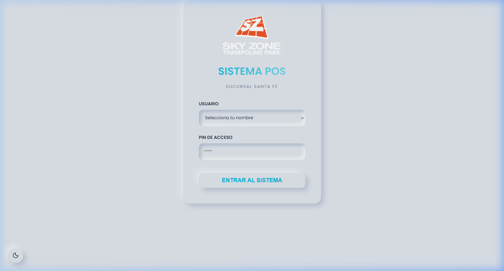
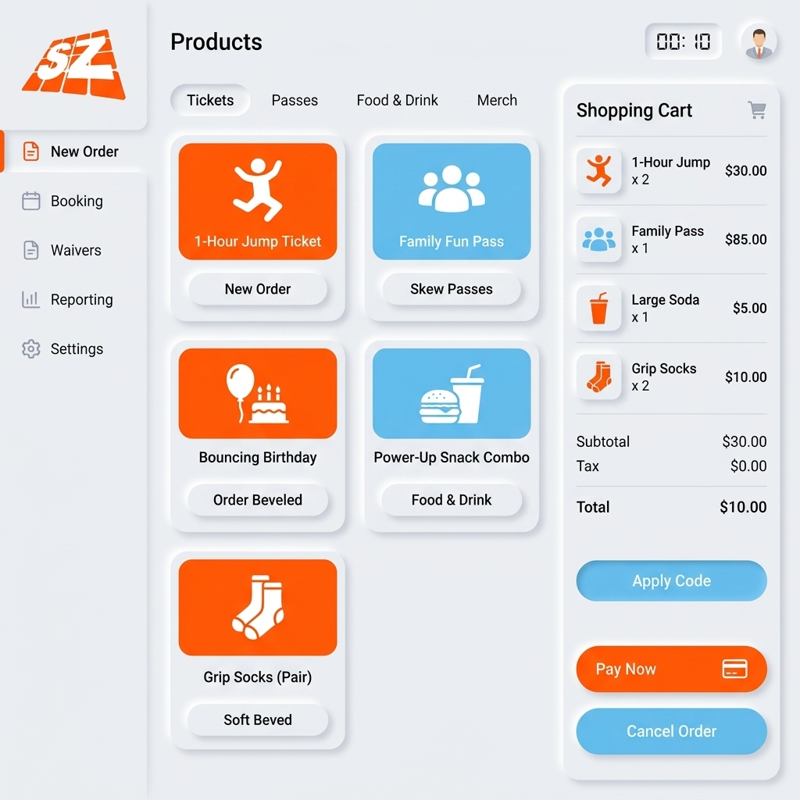
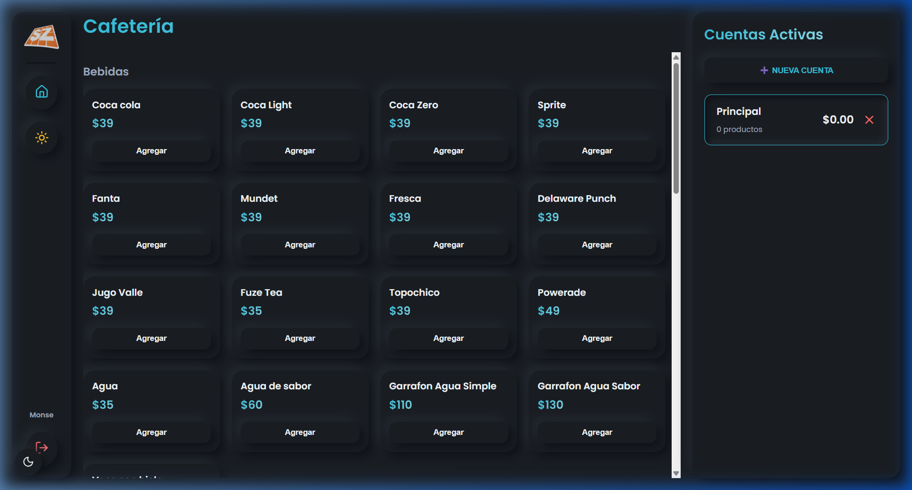
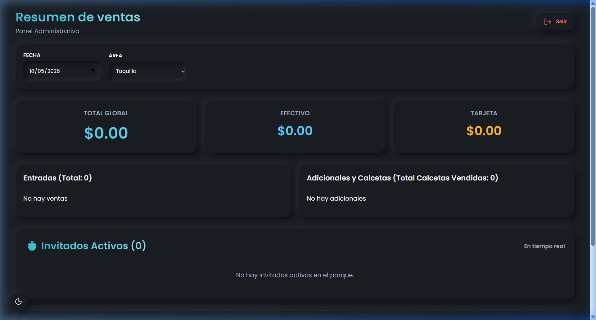

# 📖 Manual Didáctico de Operación - Punto de Venta SkyZone Santa Fe

Este manual ha sido redactado de forma detallada para guiar a los cajeros, operadores de cafetería y administradores de **SkyZone Santa Fe** en el uso diario del software de punto de venta (POS). Gracias al diseño neumórfico táctil y a la base de datos sincronizada en tiempo real, la gestión del parque se realiza de forma ágil y libre de errores.

---

## 🔐 1. Portal de Acceso y Control de Sesiones

El sistema cuenta con un control estricto de accesos basado en roles para evitar cruces de cuentas y registrar con precisión qué cajero realiza cada transacción.

### Paso a paso para iniciar el turno:
1.  Enciende la computadora del punto de venta y abre el navegador o la aplicación de escritorio.
2.  Visualizarás la pantalla de inicio de sesión neumórfica (revisa la *Figura 1*).
3.  Haz clic en el menú desplegable **"SELECCIONAR USUARIO"** y elige tu nombre. Los cajeros asignados y programados son:
    *   **Tania:** Asignada a la terminal de **Taquilla**.
    *   **Jeshua:** Asignada a la terminal de **Cafetería**.
    *   **Yunn / Sandy:** Asignados a tareas de **Administración**.
4.  Haz clic en el campo **"PIN DE ACCESO"** e ingresa tu código de seguridad de 4 dígitos o contraseña de cajero asignado.
5.  Haz clic en el botón **"ENTRAR AL SISTEMA"**. La aplicación validará tu rol en la base de datos de Firebase y te redirigirá instantáneamente a tu área de trabajo autorizada.

*Figura 1: Pantalla de inicio de sesión táctil con diseño de relieve neumórfico.*

---

## 🎟️ 2. Operación de Taquilla (Venta de Entradas y Brazaletes)

La terminal de Taquilla está optimizada para agilizar el flujo de visitantes en la entrada principal, eliminando cuellos de botella mediante cálculos automatizados.

### A. Tipos de Entradas y Brazaletes
El catálogo en pantalla está organizado en dos filas principales:
*   **Entradas Individuales (Por Tiempo):**
    *   `MEDIUM` (60 minutos de salto)
    *   `STANDARD` (120 minutos de salto)
    *   `PREMIUM` (180 minutos de salto)
    *   `SKY PASS` (Tiempo de salto ilimitado para el día)
    *   `APOYO` (Boleto de costo reducido para acompañantes o adultos que no saltarán en los trampolines).
*   **Paquetes Promocionales (Con Calcetas Incluidas por Defecto):**
    *   `Paquete Peque Aventura`
    *   `Peque Diversión`
    *   `Super Aventura`
    *   `Paquete Familiar`

*Figura 2: Panel de ventas de Taquilla en Modo Claro, con botones de productos e indicadores de salida.*

### B. Cálculo Automático de Salida (Zona Horaria CDMX)
Ya no necesitas calcular a qué hora termina el tiempo del cliente de forma manual en un reloj o papel.
*   Al momento de hacer clic en cualquier entrada por tiempo (ej. `STANDARD` de 120 minutos), el sistema toma la hora exacta del servidor en la Zona Horaria de la **Ciudad de México (CDMX)**.
*   Calcula de forma matemática la hora precisa de salida sumando los minutos correspondientes.
*   Este dato queda guardado en la base de datos de Firestore bajo el campo `exitTimestamp` y se imprimirá en el ticket del cliente para que el personal de pista audite la salida.

### C. Sistema Inteligente de Calcetas Integradas (`SkySocks`)
Para asegurar un conteo de inventario preciso en el panel administrativo:
*   Los paquetes **Peque Aventura**, **Peque Diversión** y **Super Aventura** incluyen por defecto **1 par de calcetas** en su costo base.
*   Al cobrar cualquiera de estos paquetes, el sistema inyecta de forma automática en el resumen de venta la nota informativa `(+1 calcetas)` (por ejemplo, verás: `1x Paque Peque Aventura (+1 calcetas)`).
*   Este indicador le notifica visualmente al cajero de taquilla que debe hacer entrega física del par de calcetas en el mostrador sin cobrar nada adicional.
*   En la base de datos y en el panel administrativo se sumará 1 unidad vendida al contador global de calcetas de forma matemática por cada paquete cobrado.

### D. Cobro de Locker con Precio Abierto
El botón de **Locker** no tiene un costo rígido para permitir promociones u ofertas:
1.  Haz clic sobre el botón **Locker** en la sección de adicionales.
2.  Se desplegará una ventana flotante solicitándote ingresar el precio del casillero.
3.  Escribe el precio pactado con el cliente (ej. `35.00`).
4.  Haz clic en Aceptar. El Locker se sumará al carrito con el importe capturado, y la tarjeta del producto en el catálogo mostrará el precio asignado para referencia rápida del cajero.

---

## ☕ 3. Operación de Cafetería (Cuentas Abiertas e Items Libres)

La Cafetería opera bajo un flujo continuo donde los clientes consumen alimentos y bebidas a lo largo de su estancia y liquidan su comanda antes de salir del parque.

*Figura 3: Panel táctil de Cafetería mostrando categorías de alimentos, bebidas y combos.*

### A. Sistema de Cuentas Abiertas (Comandas por Mesa/Cliente)
Para que los clientes puedan pedir alimentos en distintas ocasiones bajo una misma cuenta:
1.  **Vista de Cuentas Activas (Minimizadas):** La barra lateral derecha muestra inicialmente una lista vertical de botones compactos neumórficos con los nombres de todas las cuentas creadas (por ejemplo: `Principal`, `Mesa 3`, `Lety Familiar`) junto al dinero que acumula cada una en tiempo real.
2.  **Abrir una Cuenta Nueva:** Haz clic en el botón superior **➕ NUEVA CUENTA**, ingresa un nombre claro (ej. `Mesa 8` o el apellido del cliente) y confirma. Se creará de inmediato de forma limpia.
3.  **Desplegar Detalle de Cuenta (Ver Consumo):** Haz clic sobre cualquier cuenta de la lista. Esta **se expandirá ocupando todo el alto de la barra lateral**, ocultando las demás tarjetas. Aquí verás la lista de productos agregados, cantidades, y podrás presionar `+` para añadir más, `-` para restar o el bote de basura rojo para borrarlos de un solo golpe.
4.  **Minimizar la Cuenta Activa:** Haz clic en el botón **⬅️ Minimizar** en la parte superior izquierda de la barra lateral. Regresarás al listado de tarjetas neumórficas de cuentas abiertas sin alterar ni borrar la comanda del cliente.
5.  **Advertencia de Borrado Seguro:** Si deseas cancelar una comanda completa, haz clic en el botón **✕** de su tarjeta en la vista minimizada. El sistema te mostrará una alerta de seguridad preguntando: *¿Seguro que quieres eliminar la cuenta "Nombre de la mesa"?* para evitar que borres el consumo de un cliente por accidente.

### B. Venta de Productos Personalizados (Precio Abierto)
Si un cliente desea comprar un artículo de cafetería que no está configurado en las tarjetas de catálogo (ej. *Pastel de Chocolate especial* o una golosina fuera de menú):
1.  Desplázate hasta la sección **"Otros Productos"** al final de la pantalla de cafetería.
2.  Escribe el **Nombre del Producto** en el formulario (ej. `Muffin de Vainilla`).
3.  Ingresa el **Precio ($)** acordado (ej. `45.00`).
4.  Haz clic en **➕ AGREGAR AL CARRITO**. El producto libre se añadirá de inmediato al desglose de la cuenta activa con los datos ingresados de forma impecable.

---

## 🛒 4. Operaciones Generales del Carrito de Cobro

*   **Remover Productos de un Clic (Bote de Basura 🗑️):** Si un cliente decide cancelar un artículo que ya tenías en el carrito, ya no necesitas presionar el botón de restar (`-`) hasta llegar a cero. Simplemente haz clic en el icono rojo del **Bote de Basura** ubicado al lado derecho del total del producto en la lista. Se borrará al instante y el total general se recalculará.
*   **Completar la Orden (Cerrar Cuenta):** Cuando el cliente vaya a pagar:
    1.  Haz clic en el botón **"COMPLETAR ORDEN"** en la parte inferior del carrito. En cafetería, esto cerrará la comanda activa de forma automática tras procesar el pago.
    2.  Se abrirá el modal interactivo de cobro (**PaymentModal**).
    3.  Elige la forma de pago preferida del cliente: **EFECTIVO** o **TARJETA**.
    4.  Confirma la transacción. El sistema guardará el registro en Firebase con la fecha y hora exacta, limpiará la cuenta y abrirá de inmediato la vista del controlador de impresión del navegador para emitir el ticket físico para la impresora térmica.

---

## 📊 5. Panel Administrativo (Control Operativo y Auditoría)

El panel administrativo es la herramienta del gerente o supervisor para auditar la salud financiera y operativa de **SkyZone Santa Fe** en tiempo real.

*Figura 4: Panel administrativo general en Modo Oscuro, con métricas de ventas y listado de saltadores.*

### A. Reportes Financieros y de Ventas
El panel calcula de forma autónoma y en tiempo real las métricas contables del día:
*   **Ingresos Totales ($):** Dinero bruto acumulado de todas las ventas del día.
*   **Ingresos por Efectivo / Tarjeta:** Desglose exacto del flujo de efectivo en caja frente al total procesado por terminal bancaria (útil para arqueos de caja al final del turno).
*   **Saltadores Activos:** Número de brazaletes vigentes saltando dentro del parque en este preciso segundo.
*   **Calcetas Vendidas:** Total acumulado de calcetas físicas entregadas al cliente (la suma de ventas individuales de calcetas más las calcetas calculadas por sistema en paquetes).

### B. Monitor de Saltadores Activos (Guest List)
Esta lista se sincroniza reactivamente con las ventas de Taquilla:
*   Detalla el nombre de cada saltador, su boleto o paquete adquirido y su hora programada de salida.
*   Muestra un **contador regresivo dinámico en minutos**.
*   *Control Táctil:* Cuando el contador llega a cero, el registro se retira de la lista de forma automática, permitiendo identificar rápidamente a clientes que ya excedieron su tiempo de salto.

### C. Tabla de Ventas y Consola de Gestión (CRUD de Firebase)
Ubicada en la parte inferior de la pantalla de administración, es la herramienta de control financiero para corregir errores humanos de cobro:

1.  **Modificar Registros de Ventas (✏️ Editar):**
    *   Haz clic en el botón del **Lápiz azul** junto a cualquier venta del listado diario.
    *   Se abrirá una ventana emergente con todos los campos de la venta cargados.
    *   Puedes reescribir el nombre del **Cliente**, alternar el **Método de Pago** (Efectivo/Tarjeta), cambiar el **Total cobrado**, actualizar el resumen de **Entradas** o **Adicionales**, y redefinir la **Hora de Salida**.
    *   Haz clic en Guardar. Los datos se escribirán directamente en Firestore, recalculando instantáneamente todos los contadores de dinero y calcetas del panel administrativo sin necesidad de refrescar la página.
2.  **Cancelar Ventas Permanentemente (🗑️ Borrar):**
    *   Si una venta fue cobrada por error o requiere cancelación total, haz clic en el botón del **Bote de Basura rojo** del registro.
    *   El sistema te solicitará confirmar la acción. Al presionar aceptar, la venta se eliminará de Firestore de forma permanente y segura, descontando sus importes de la caja del día.

---

## 🎨 6. Cambio de Tema en Tiempo Real (Modo Oscuro)

Para activar el Modo Oscuro (Cyber Dark) y relajar tu vista durante los turnos de la tarde/noche:
*   **En Taquilla o Cafetería:** En la barra de navegación lateral izquierda (donde está el logo de SkyZone), haz clic en el botón redondo que muestra una **Luna** 🌙. La pantalla adoptará un elegante fondo oscuro mate con sombras físicas y relieves táctiles neón azul y naranja. Para volver al Modo Claro, haz clic sobre el botón del **Sol** ☀️.
*   **En Login o Administración:** Haz clic en el botón redondo flotante ubicado en la **esquina inferior izquierda de la pantalla**.
